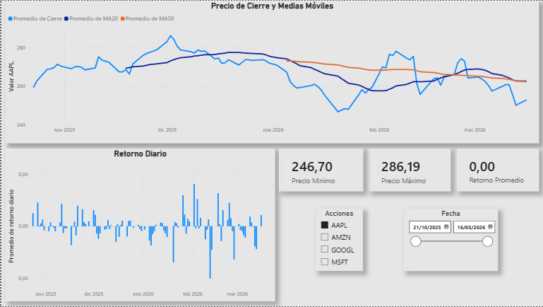
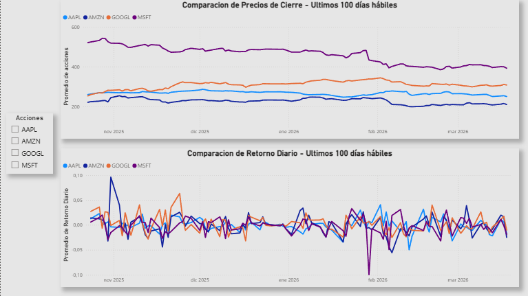
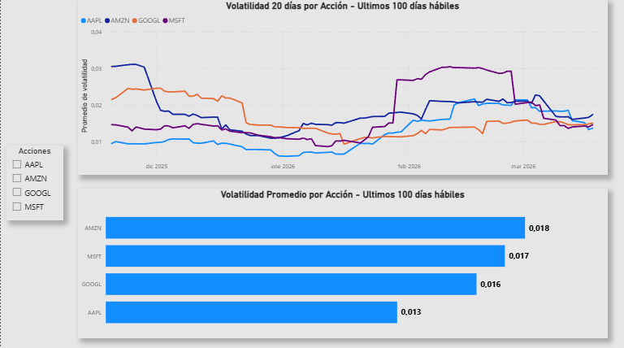
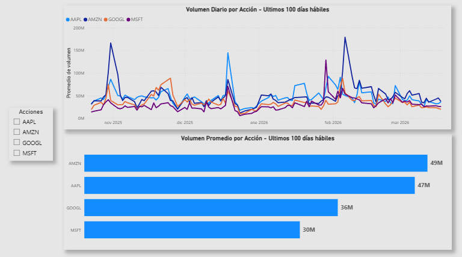
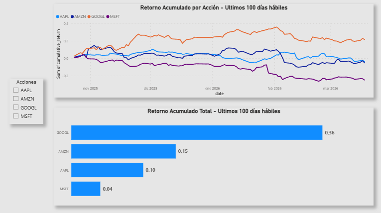

📊 Financial Analysis Dashboard
Pipeline de datos end-to-end que extrae precios históricos de acciones en tiempo real, los procesa con Python y los visualiza en un dashboard interactivo de Power BI.

🔍 Problema que resuelve
Los inversores necesitan comparar el rendimiento, riesgo y tendencia de múltiples acciones en un solo lugar. Este proyecto automatiza ese proceso: desde la extracción de datos crudos hasta la visualización de métricas financieras clave, sin intervención manual.

🛠️ Stack tecnológico
Capa                    Tecnología
Extracción              Python + Alpha Vantage API
Transformación          Pandas
Almacenamiento          SQL Server
Visualización           Power BI
Control de versiones    Git + GitHub

⚙️ Arquitectura del pipeline
Alpha Vantage API
       ↓
  extract.py       →   Extrae precios históricos de 4 acciones vía HTTP
       ↓
  transform.py     →   Calcula métricas financieras con Pandas
       ↓
  SQL Server       →   Almacena datos crudos y métricas
       ↓
  Power BI         →   Dashboard interactivo con 5 páginas de análisis

📈 Métricas calculadas

MA20 / MA50: Medias móviles de 20 y 50 días para identificar tendencias
Retorno diario: Variación porcentual del precio de cierre día a día
Volatilidad 20 días: Desvío estándar del retorno en ventana móvil, mide el riesgo
Retorno acumulado: Rendimiento total desde el inicio del período

💡 Insights del dashboard
Análisis Individual — AAPL, MSFT, GOOGL, AMZN
Precio de cierre con medias móviles superpuestas. Permite identificar visualmente si una acción está en tendencia alcista o bajista respecto a su promedio histórico.

Comparación de Precios
Las 4 acciones en el mismo gráfico. MSFT opera a precios significativamente más altos. GOOGL y AMZN muestran tendencias similares en el período analizado.

Volatilidad — ¿Cuál es la acción más riesgosa?
AMZN fue la acción más volátil del período (riesgo más alto). AAPL la más estable. Todas convergieron hacia niveles similares en marzo 2026, lo que indica una normalización del mercado.

Volumen de Operaciones
Los picos de volumen en noviembre 2025 y febrero 2026 coinciden exactamente con los picos de volatilidad — confirmando la correlación entre volumen y movimientos bruscos de precio. AMZN y AAPL son las acciones más transadas del período.

Retorno Acumulado — ¿Cuál fue la mejor inversión?
Si hubieras invertido $100 en octubre 2025:
GOOGL → +36% de retorno. La mejor inversión del período.
AMZN → +15%
AAPL → +10%
MSFT → +4%. La peor performance del grupo.

🚀 Cómo ejecutar

1. Clonar el repositorio
2. Crear un archivo .env en la raíz con el siguiente contenido:
      API_KEY=tu_api_key_de_alpha_vantage

3. Ejecutar el pipeline:
      py etl/transform.py

4. Abrir en Power BI Desktop
reports/financial_analysis_dashboard.pbix 

📦 Acciones analizadas
AAPL · MSFT · GOOGL · AMZN — Últimos 100 días hábiles de mercado (oct 2025 – mar 2026)